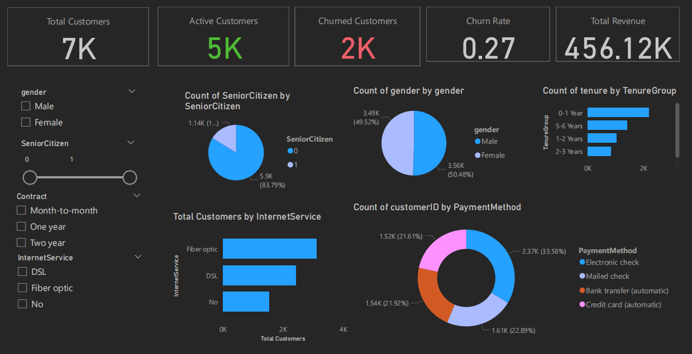

# Customer Churn Analytics Dashboard (Power BI)

## Overview
An interactive Power BI dashboard analyzing customer behavior, churn rates, and revenue across 7,000+ customers. The project focuses on providing actionable insights to reduce churn and improve customer retention strategies.

## Features
- Dynamic KPIs: Total Customers, Active Customers, Churned Customers, Churn Rate, and Total Revenue
- Interactive Filters: Gender, Senior Citizen Status, Internet Service Type, Contract Duration
- Visualizations: Pie Charts, Bar Charts, Donut Charts
- Advanced Segmentation and Real-time Data Exploration
- Slicers and dynamic filtering to drill down customer attributes

## Dashboard Preview

Here is a snapshot of the interactive Power BI dashboard:

> The dashboard highlights churn behavior segmented by demographics, payment methods, and contract types.

## Key Insights
- Churn rate stands at **27%**, highlighting a need for focused retention strategies.
- Month-to-month contract customers showed higher churn compared to one/two-year contracts.
- Customers using **fiber optic** internet services were more likely to churn than DSL users.
- **Electronic check** payment method had the highest churn rates.
- Senior Citizens account for about **16%** of the customer base.

## Tools & Technologies
- **Power BI** for Dashboard Development
- **DAX** for basic calculated fields and KPIs
- **Data Modeling** to connect and clean datasets
- **Data Visualization** best practices for effective storytelling

## License
This project is open-source and available under the [MIT License](LICENSE).

## Author
[**Aakaash M S**](https://github.com/msaakaash)
